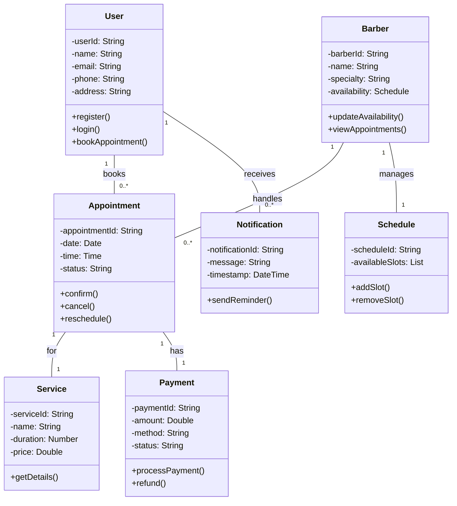

#  class diagram in Mermaid.js

# class diagram

```mermaid
classDiagram
class User {
  -userId: String
  -name: String
  -email: String
  -phone: String
  -address: String
  +register()
  +login()
  +bookAppointment()
}

class Barber {
  -barberId: String
  -name: String
  -specialty: String
  -availability: Schedule
  +updateAvailability()
  +viewAppointments()
}

class Appointment {
  -appointmentId: String
  -date: Date
  -time: Time
  -status: String
  +confirm()
  +cancel()
  +reschedule()
}

class Service {
  -serviceId: String
  -name: String
  -duration: Number
  -price: Double
  +getDetails()
}

class Payment {
  -paymentId: String
  -amount: Double
  -method: String
  -status: String
  +processPayment()
  +refund()
}

class Schedule {
  -scheduleId: String
  -availableSlots: List
  +addSlot()
  +removeSlot()
}

class Notification {
  -notificationId: String
  -message: String
  -timestamp: DateTime
  +sendReminder()
}

User "1" -- "0..*" Appointment : books
Barber "1" -- "0..*" Appointment : handles
Appointment "1" -- "1" Service : for
Appointment "1" -- "1" Payment : has
Barber "1" -- "1" Schedule : manages
User "1" -- "0..*" Notification : receives
```

